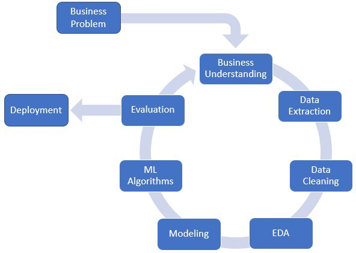

# High Value Customers Segmentation - Champions Program

 

#### This project was made by Marx Cerqueira.

#### High Value Customers Segmentation - Champions Program
# 1. Business Problem.

* All-in-One-Place company is a online retail store based in UK, and has captured the sales data for different products for the period of one year (Nov 2016 to Dec 2017).

* Within just one year of operation, the marketing team realized that some customers buy more expensive products with high frequency and contribute to a significant portion of the company's revenue.

* Due to this, the marketing team will launch a loyalty program for the best customers in the company's database, called High Value Customers - Champions. However, the team does not have advanced knowledge of data analysis to select program participants.

* For this reason, the marketing team asked me as a data scientist to select eligible customers for this loyalty program using advanced data manipulation and modeling techniques.

#### What solution to the business problem will this project deliver?

As a Data Scientist of the company I'll find significant customers for the business who make high purchases and who add more value to the company's annual revenue. Using unsupervised machine modeling concepts and RFM methodology to segment customers into groups and decides each one will enjoy the loyalty program Champions.

**Deliverables:**

As a result for this project, we are expected to deliver a list of people eligible to participate in the Champions program, along with a report answering the following questions:

* Who are the eligible people to participate in the Champions program?
* How many customers will be part of the loyalty group?
* What are the main characteristics of these customers?
* What is the percentage of revenue contribution that comes from the Champions?
* What are the conditions for a person to be eligible for Champions?
* What are the conditions for a person to be removed from Champions?
* What are the guarantees that the Champions program is better than the rest of the base?
* What actions can the marketing team take to increase sales?

# 2. Business Assumptions.

* Invoices where items have unit price less than **0.04** were removed;

* I have created fictitious ID's for consumers without ID to maintain their buying behavior;

* Negative quantity items were considered as returned items;
 
* Invoice numbers with the letter C were considered as returned items;

* Customers id's 16446, 12346, 15098 were removed due bad habits, like buy one item and returned it at the same day. Or they returned more items than purchased;

* Stock codes with 'POST', 'D', 'DOT', 'M', 'S', 'AMAZONFEE', 'm', 'DCGSSBOY','DCGSSGIRL', 'PADS', 'B', 'CRUK' were removed because we did not know the meaning, we have to ask the others teams next CRISP cycle.

# 3. Solution Strategy

My strategy to solve this challenge was the IoT method which means:

**Input**

**Output**

**Tasks**

### Project Cycle
The main ideia here is to add value to the business as soon as possible in each cycle of the project.

&nbsp; 
  

    
  

  &nbsp; 

**Step 01. Imports:**

* Import required libraries and functions.

**Step 02. Data Extraction:**

* For the available data, check files and data fields description. Then load data from CSV file.

**Step 03. Data Description:**

* Rename columns and check the number of rows in the table (does it requires big data tools?). Handle missing values and convert data types. Then use statistics metrics to identify data outside the scope of business.

**Step 04. Data Filtering:**

* Filter rows and select columns that do not contain relevant information for modelling or do not match the scope of the business.

**Step 05. Feature Engineering:**

* Create relevant variables for the project.

**Step 06. Exploratory Data Analysis and Space Study:**

* An analysis to validate business hypotheses, combat business guesswork, check each feature by itself and the relationship among them.

* We are looking for features with high variance so it can give us a better explanation of the phenomenon.

* Explore the Embedding Spaces to check how the data is distributed in those different spaces, the goal here is to choose the best for clustering the customers.

**Step 07. Feature Selection:**

* Select the most significant attributes for training the model based on correlation and in the business problem

**Step 08. Data Preparation:**

* Prepare data so that the Machine Learning models can more easily learn and perform more accurately. Then create an embedded space for data.

**Step 09. Hyperparameter Fine Tunning:**

* Test different Machine Learning models and select the one with the best performance. Then, choose the best values for each parameter of the selected ML model.

**Step 10. Model Training:**

* Create the final Machine Learning model and measure its performance.

**Step 11. Cluster Analysis:**

* Analyse clusters after Machine Learning modelling.

**Step 12. Exploratory Data Analysis With Business Insights:**

* Test business hypotheses and answer business questions.

**Step 13. Deployment:**

* Plan deployment architecture and implement it.

# 4. Top 3 Data Insights

1. U

2. l

3. lk

# 5. Machine Learning Model Applied
Gaussian Mixture Model

# 6. Machine Learning Modelo Performance

# 7. Business Results

# 8. Conclusions

# 9. Lessons Learned

# 10. Next Steps to Improve

# LICENSE

# All Rights Reserved - Comunidade DS 2021
